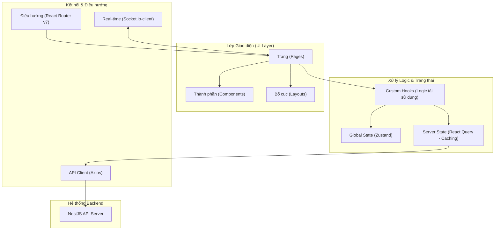
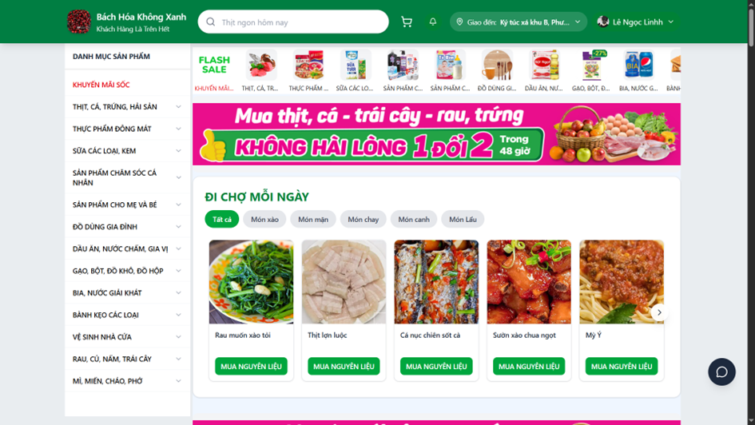
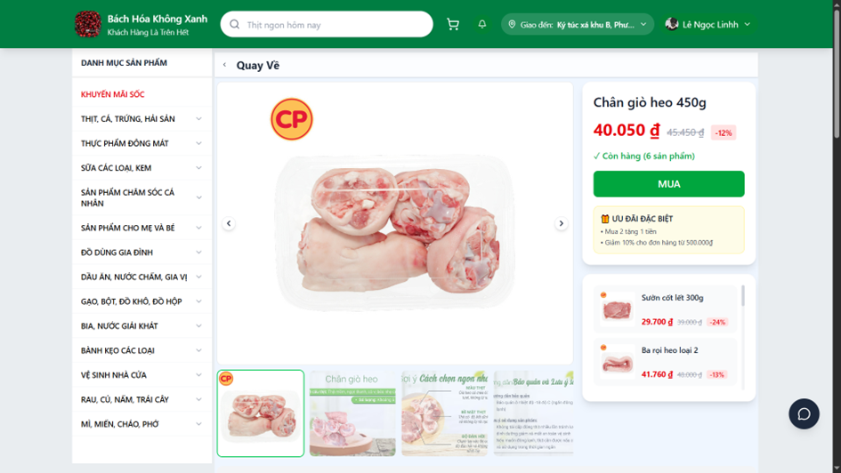
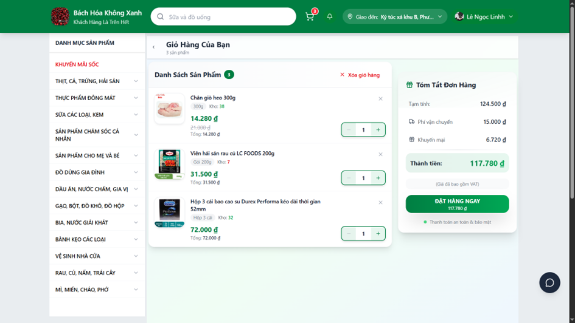
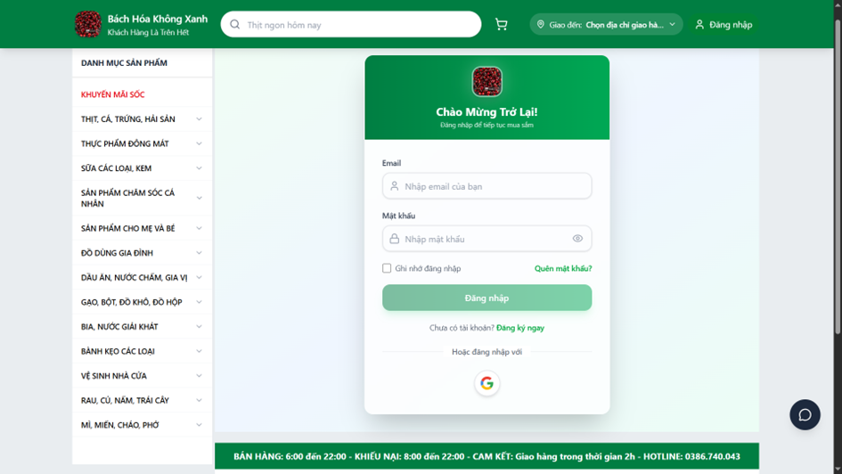
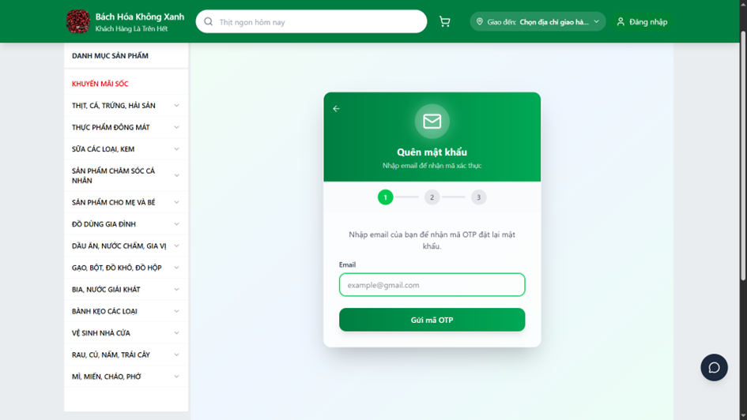
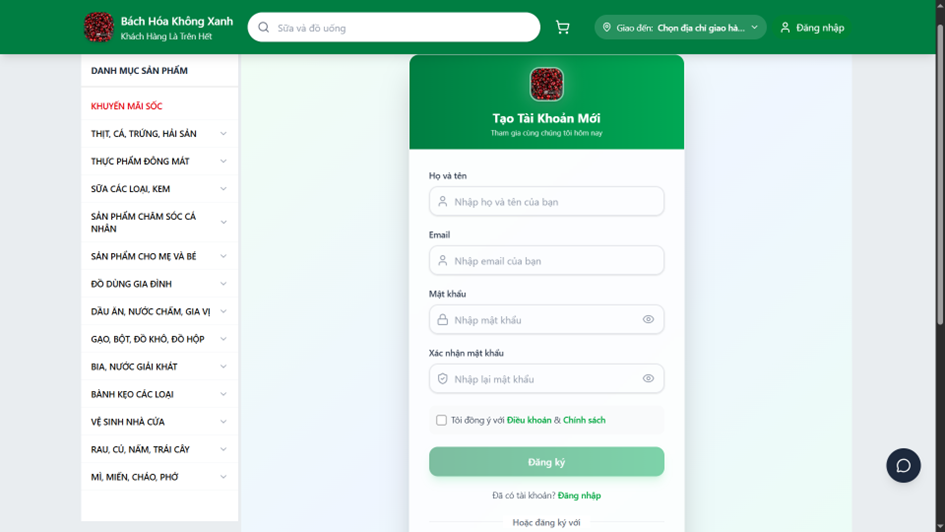

# Web Siêu Thị Client (React + Vite)

## 📝 Giới thiệu

Đây là phần Frontend (giao diện người dùng) của hệ thống **Web Siêu Thị**. Dự án là một Single-Page Application (SPA) hiện đại, mang đến trải nghiệm mượt mà cho khách hàng khi mua sắm, giao diện trực quan cho quản trị viên (Admin) và tiện ích theo dõi dành riêng cho Shipper.

## 🚀 Công nghệ sử dụng

- **Framework:** React v19
- **Build Tool:** Vite
- **Styling:** Tailwind CSS, Radix UI (Shadcn UI)
- **State Management:** Zustand, React Query
- **Routing:** React Router DOM v7
- **Bản đồ & Biểu đồ:** Leaflet (React-Leaflet), Recharts
- **Khác:** Socket.io-client (Real-time), Lucide React (Icons).

## 🏗️ Kiến trúc

Dự án được xây dựng dựa trên **Component-based Architecture**. Phân chia thư mục rõ ràng: `pages` cho các trang giao diện, `components` cho các UI Element dùng chung, `stores` cho quản lý trạng thái hiển thị (State), và `api` chứa các tác vụ gọi API ra bên ngoài.

## 📁 Cấu trúc dự án

Dưới đây là sơ đồ tổ chức thư mục mã nguồn chính (`src/`) của dự án:

```text
src/
├── api/                # Các dịch vụ gọi API (Axios, Services)
├── components/         # Các thành phần giao diện dùng chung (Button, Input, v.v.)
├── hooks/              # Các Custom Hooks xử lý logic tái sử dụng
├── layouts/            # Các bố cục khung cho trang (Navbar, Sidebar, v.v.)
├── pages/              # Các trang giao diện chính (Home, Login, Admin, v.v.)
├── routes/             # Cấu hình điều hướng (React Router)
├── stores/             # Quản lý trạng thái toàn cục (Zustand)
├── types/              # Định nghĩa các Interface và Type
└── main.tsx            # Điểm khởi đầu của ứng dụng React
```



## 🌟 Các tính năng chính (chèn ảnh)

### 🛒 Dành cho Khách hàng (Customer Portal)

- **Trang chủ & Danh sách sản phẩm:** Xem danh mục, banner khuyến mãi và sử dụng bộ lọc tìm kiếm nâng cao để tra cứu thông tin sản phẩm.
- **Chi tiết sản phẩm:** Xem thông tin, hình ảnh chi tiết, đánh giá từ khách hàng khác và chọn số lượng để thêm vào giỏ.
- **Giỏ hàng & Thanh toán:** Quản lý số lượng mặt hàng trong giỏ, áp dụng mã giảm giá ưu đãi, và thanh toán online qua **VNPay**.
- **Quản lý tài khoản:** Xem lịch sử mua hàng, theo dõi lộ trình đơn hàng thời gian thực.
- **Chat hỗ trợ:** Khung chat trực tuyến để nhắn tin với nhân viên hỗ trợ (Real-time).

<div align="center">
  
  <p><i>Giao diện trang chủ</i></p>
  <br/>
  
  <p><i>Giao diện chi tiết sản phẩm</i></p>
  <br/>
  
  <p><i>Giao diện giỏ hàng</i></p>
</div>

### 🛡️ Dành cho Quản trị viên (Admin Dashboard)

- **Báo cáo & Thống kê:** Bảng điều khiển tích hợp biểu đồ trực quan (Recharts) hiển thị doanh thu, đơn hàng và sự phát triển của hệ thống.
- **Quản lý danh mục & hàng kho:** Thêm, sửa, xoá các sản phẩm đang hiển thị trên web.
- **Quản lý đơn hàng:** Theo dõi tất cả đơn, duyệt đơn hàng mới và chỉ định đối tác giao nhận (Shipper).
- **Quản lý nhân sự:** Cấp quyền cho khách hàng, nhân viên (Staff) và Shipper.

<div align="center">
  
  <p><i>Giao diện Admin Dashboard</i></p>
  <br/>
  
  <p><i>Giao diện thống kê doanh thu</i></p>
</div>

### 🚚 Dành cho Người giao hàng (Shipper Portal)

- **Danh sách đơn giao:** Cập nhật danh sách đơn hàng đã được phân công.
- **Cập nhật trạng thái:** Nhấn xác nhận để đổi trạng thái đơn (Đã lấy hàng, Đang giao, Quá trình hoàn tất...).
  _(Chèn ảnh giao diện ứng dụng theo dõi dành cho Shipper tại đây)_

### 🔐 Các luồng xác thực (Auth)

- Trang Đăng ký, Đăng nhập với giao diện đẹp mắt.
- **Quên mật khẩu** và giao diện nhập mã xác thực OTP.

<div align="center">
  
  <p><i>Giao diện đăng nhập</i></p>
  <br/>
  
  <p><i>Giao diện đăng ký tài khoản</i></p>
  <br/>
  
  <p><i>Giao diện quên mật khẩu</i></p>
</div>

## 🛠️ Cài đặt

1. Clone dự án: `git clone <link_repo>`
2. Cài đặt dependency: `npm install`
3. Cập nhật biến môi trường: Tạo file `.env` và thiết lập URL trỏ tới Backend API.
4. Chạy dự án: `npm run dev`
5. Build dự án (Deploy): `npm run build`

## 🔗 API Reference

- Giao diện Frontend giao tiếp với các API chính thông qua thư mục `src/api` và được handle data bởi **React Query**.

## 💡 Bài học kinh nghiệm

- Sử dụng Component linh hoạt giúp dễ dàng tái sử dụng các Button, Input cho Form đăng nhập tới Dashboard form.
- Cách quản lý Global State bằng **Zustand** kết hợp với **React Query** để tối ưu hóa việc gọi lại API (Caching Data không cần thiết), giúp tăng tốc độ tải trang đáng kể.
- Áp dụng Lazy Loading & Suspense trong React để chia nhỏ bundle Javascript khi trang Load.
